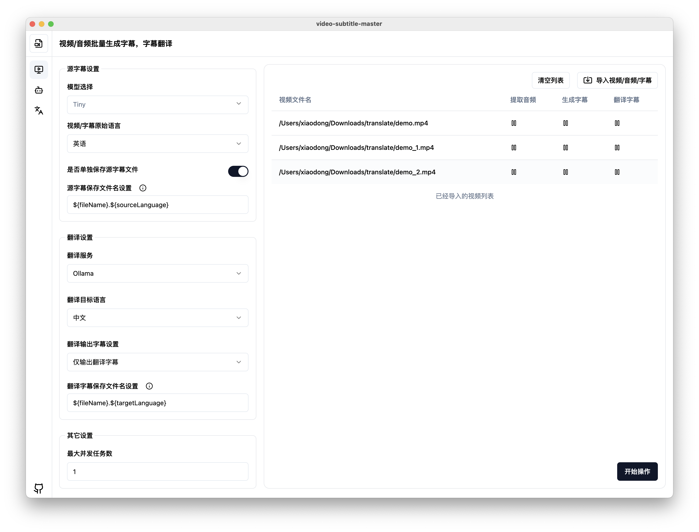

# video-subtitle-master
批量为视频生成字幕，并可将字幕翻译成其它语言。这是在之前的一个开源项目 [VideoSubtitleGenerator](https://github.com/buxuku/VideoSubtitleGenerator) 的基础上，制作成的一个客户端工具，以方便更多朋友们的使用。



> [!NOTE]
> 当前 release 包在 mac 环境下测试通过， window 仅在虚拟机测试通过，如果大家在运行过程中遇到问题，欢迎提 Issue 反馈。

## 💥特性

它保留了之前 [VideoSubtitleGenerator](https://github.com/buxuku/VideoSubtitleGenerator) 这个命令行工具的全部特性

- 源语言字幕文件和目标语言字幕文件放在视频同目录下，方便播放时任意挂载字幕文件
- 批量处理目录下面的所有视频文件
- 可以只生成字幕，不翻译，方便批量为视频生成字幕
- 支持火山引擎翻译
- 支持百度翻译
- 支持 deeplx 翻译 （批量翻译容易存在被限流的情况）
- 自定义字幕文件名，方便兼容不同的播放器挂载字幕识别
- 自定义翻译后的字幕文件内容，纯翻译结果，原字幕+翻译结果
- 项目集成 `whisper.cpp`， 它对 apple silicon 进行了优化，有较快的生成速度
- 项目集成了 `fluent-ffmpeg`, 无须安装 `ffmpeg`

## 翻译服务

本项目的翻译能力是基于 **百度/火山/deeplx** 的翻译API来实现的，这些 API 的使用需要申请对的 KEY 和 SECRET， 因此，如果你需要使用到翻译服务，需要先申请一个 API 。

具体的申请方法，可以参考 https://bobtranslate.com/service/ ，感谢 [Bob](https://bobtranslate.com/) 这款优秀的软件。

## 🔦使用 (普通用户)

前往 [release](https://github.com/buxuku/video-subtitle-master/releases) 页面根据自己的操作系统下载安装包，安装后即可直接使用

## 🔦使用 (开发用户)

1️⃣ 克隆本项目在本地

```shell
git clone https://github.com/buxuku/video-subtitle-master.git
```

2️⃣ 在项目中执行 `yarn install` 或者 `npm install`

```shell
cd video-subtitle-master
yarn install 
```

3️⃣ 依赖包安装好之后，执行 `yarn start` 或者 `npm start` 
