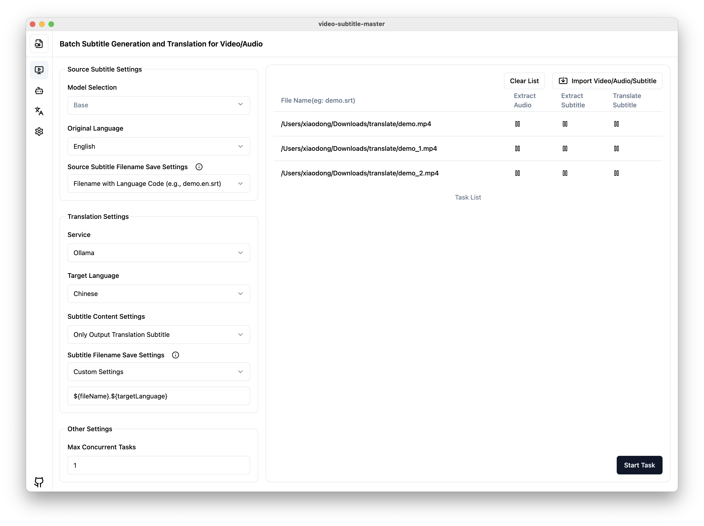

# Video Subtitle Master

English | [中文](./README.md)

Video Subtitle Master is a powerful desktop application for batch generating subtitles for videos and translating them into other languages. This project is an enhanced version of the open-source [VideoSubtitleGenerator](https://github.com/buxuku/VideoSubtitleGenerator), redesigned as a user-friendly client tool.



> [!NOTE]
> The current release has been tested on macOS. Windows testing was done in a virtual environment. If you encounter any issues, please feel free to open an Issue for feedback.

## 💥 Features

This application retains all the features of the original [VideoSubtitleGenerator](https://github.com/buxuku/VideoSubtitleGenerator) command-line tool, with the following enhancements:

- Graphical user interface for easier operation
- Source and target language subtitle files are saved in the same directory as the video for convenient subtitle attachment during playback
- Batch processing of video/audio/subtitle files
- Support for generating subtitles from video or audio files
- Ability to translate generated or imported subtitles
- Multiple translation services supported:
  - Volcano Engine Translation
  - Baidu Translation
  - DeepLX Translation (Note: Batch translation may be rate-limited)
  - Local Ollama model translation
  - Support for OpenAI-style API translations (e.g., [deepseek](https://www.deepseek.com/), [azure](https://azure.microsoft.com/))
- Customizable subtitle file naming for compatibility with various media players
- Flexible translated subtitle content: choose between pure translation or original + translated subtitles
- Integrated `whisper.cpp` with optimization for Apple Silicon, offering faster generation speeds
- Built-in `fluent-ffmpeg`, eliminating the need for separate `ffmpeg` installation
- Support for running locally installed `whisper` command
- Option to choose model download source (domestic mirror or official source)
- Customizable number of concurrent tasks

## Core ML support

Starting from version 1.20.0, Core ML is supported on Apple Silicon, providing faster speech recognition. For users who have previously installed older versions, please uninstall the old version first and then reinstall the new version. Additionally, select "Reinstall Whisper" in the settings interface to enable Core ML acceleration.

## Translation Services

This project supports various translation services, including Baidu Translation, Volcano Engine Translation, DeepLX, local Ollama models, and OpenAI-style APIs. Using these services requires the appropriate API keys or configurations.

For information on obtaining API keys for services like Baidu Translation and Volcano Engine, please refer to https://bobtranslate.com/service/. We appreciate the information provided by [Bob](https://bobtranslate.com/), an excellent software tool.

## 🔦 Usage (For End Users)

1. Go to the [releases](https://github.com/buxuku/video-subtitle-master/releases) page and download the appropriate package for your operating system
2. Install and run the program
3. Configure the desired translation services within the application
4. Select the video or subtitle files you want to process
5. Set relevant parameters (e.g., source language, target language, model)
6. Start the processing task

## 🔦 Usage (For Developers)

1️⃣ Clone the project locally

```shell
git clone https://github.com/buxuku/video-subtitle-master.git
```

2️⃣ Install dependencies using `yarn install` or `npm install`

```shell
cd video-subtitle-master
yarn install 
```

3️⃣ After installing dependencies, run `yarn start` or `npm start` to launch the project

```shell
yarn start
```

## Manually Downloading and Importing Models

Due to the large size of model files, downloading them through the software may be challenging. You can manually download models and import them into the application. Here are two links for downloading models:

1. Domestic mirror (faster download speeds):
   https://hf-mirror.com/ggerganov/whisper.cpp/tree/main

2. Hugging Face official source:
   https://huggingface.co/ggerganov/whisper.cpp/tree/main

After downloading, you can import the model files into the application using the "Import Model" feature on the "Model Management" page.

Import steps:
1. On the "Model Management" page, click the "Import Model" button.
2. In the file selector that appears, choose your downloaded model file.
3. After confirming the import, the model will be added to your list of installed models.

## Common Issues

##### 1. "The application is damaged and can't be opened" message
Execute the following command in the terminal:

```shell
sudo xattr -dr com.apple.quarantine /Applications/Video\ Subtitle\ Master.app
```
Then try running the application again.

## Contributing

Issues and Pull Requests are welcome to help improve this project!

## License

This project is licensed under the MIT License. See the [LICENSE](LICENSE) file for details.

## Star History

[](https://star-history.com/#buxuku/video-subtitle-master&Date)